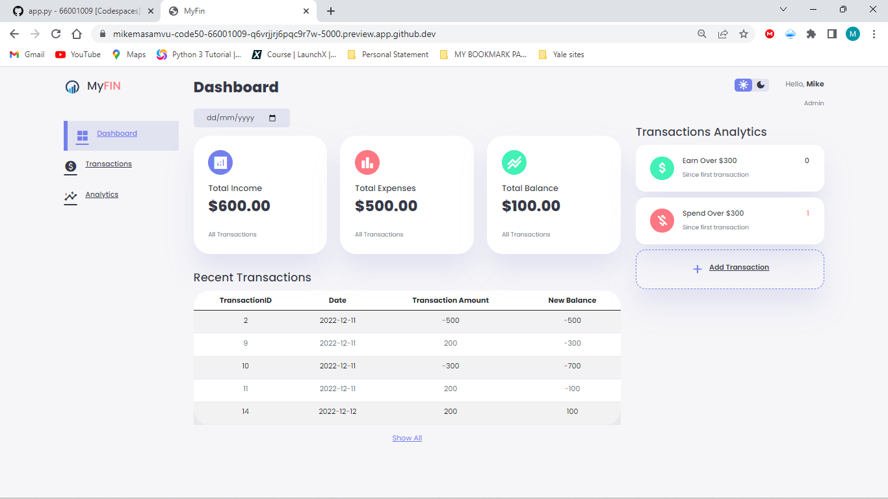

# MyFin

MyFin is a website that allows a user to store their financial records.



## Background

This web app will allow a user to input their transactions. Each transaction will either be an income or expense. The date and amount will be included as part of the data for each transaction so that the user can trace each transaction easily.

### Running

Start Flask's built-in web server (within `final-project/`):

```
$ flask run
```

Visit the URL outputted by `flask` to the see the distribution code in action.

### Understanding

### Static

The static folder has 4 files, one javascript file called index.js, one image logo and one styles.css file. The two javascript files add interactivity to the html for example the use of the theme-toggler function to change the background theme of the page. I chose javacript because it easily adds interactivity to the web app. The styles.css contains all the styling of the websites so that they can look attractive.

### Templates

The templates has three templates for the three html files of the web app where `Index.html` is the homepage of the website. All the pages have reference links for the css stylesheet, javascript and bootstrap. I used bootstrap because it is easy and convenient as it allowed me to use pre-existing designs. I also referenced links for fonts so that l could use the google icons on my web app.

### App.py

I used flask because it gives me more control over my website and allows me to use python to display user input on the web app. The `idex()` and `analytics()` function is used to display information from the `Budget.db` onto the homepage. The `transactions()` function captures user input and stores it into the `Budget.db`.

### Budget.db

The `Budget.db` stores all the information of the transactions the user input. It has one table called `transactions`. The table has 4 columns (transaction_id INT PRIMARY KEY, date DATE, amount NUMERIC, balance NUMERIC)

### Helpers.py

Helpers function contains the `usd()` function which is used to format numbers into the currency format.

