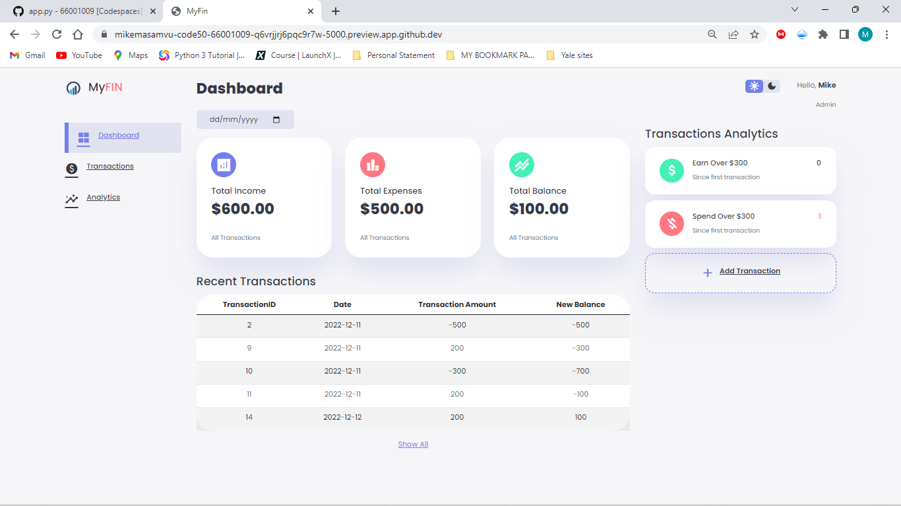
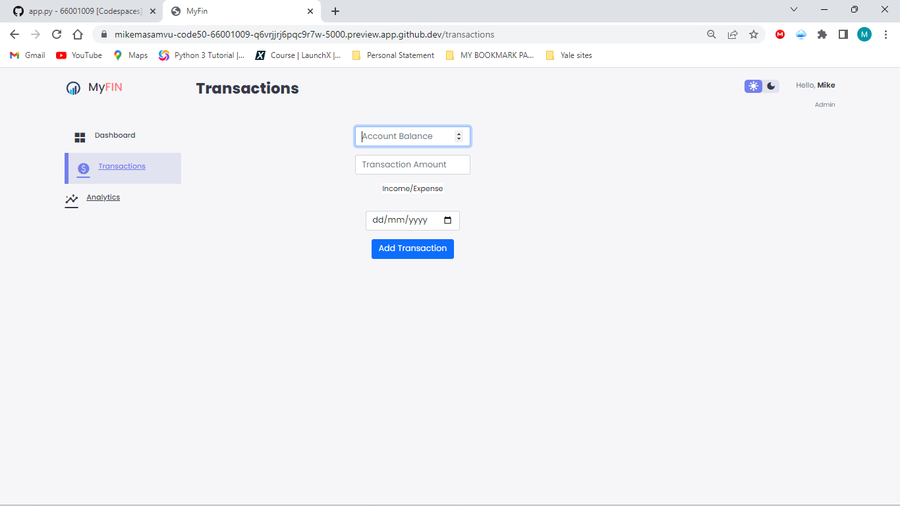
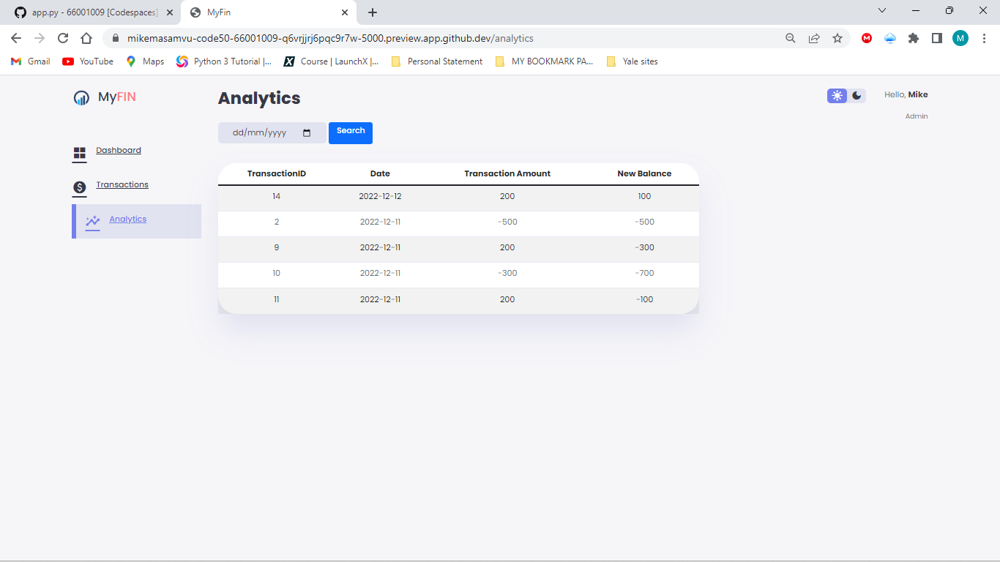

# MyFin

MyFin is a website that allows a user to store their financial records. 



## Background

This web app will allow a user to input their transactions. Each transaction will either be an income or expense. The date and amount will be included as part of the data for each transaction so that the user can trace each transaction easily. 

### Running

Start Flask's built-in web server (within `final-project/`):

```
$ flask run
```

Visit the URL outputted by `flask` to the see the distribution code in action.

### Dashboard


The home page will be the `Dashboard` were the user will be able to see the summary of their financial data. On the left there will be a vertical navigation bar that will allow the user to navigate to other webpages. In the middle there will be sum of all incomes earned as `Total Income`, sum of all expenses incurred as `Total Expenses` and the balance of the two as `Total Balance`. Below that is the `Recent Transactions` table were the user can see the 5 most recent transactions. If the user clicks the `Show All` link, they will be redirected to another page where all the transaction history will be shown. On the right section there will be a section where the user can see count of the number of transactions were the user earn over $300 as `Earn Over $300` and were they spend over $300 as `Spend Over $300`. Below that is the `Add Transaction` button which allows the user to add more transactions. To the top-right corner is the `theme toggler` button that allows the user to change the page theme from light to dark. 

### Transactions



If you click the `Add Transaction` button or `Transaction` on the navigation bar, then you will be redirected to this page. This is the section where the user will add their transaction data. They will be prompted to input their current account balance, transaction amount, transaction type (whether income/ expnses) and date of transaction. By clicking the `Add Transaction` button, the user will be redicted to the homepage where the summary data will be updated, with that transaction showing up as the first transaction under the `Recent Transactions` section. 

### Analytics



If you navigate through the analytics page through the navigation bar or `Show All` link on homepage, you will be able to see the history of all the transactions. The user can specifically search for a specific transaction by inputting the date of the transaction on the date input box and then click `Search`. 

### Run-through video of web app

Here is the link with the tutorial of how to use the web app:

[https://youtu.be/cHpNOPd2PvU](https://youtu.be/cHpNOPd2PvU)

